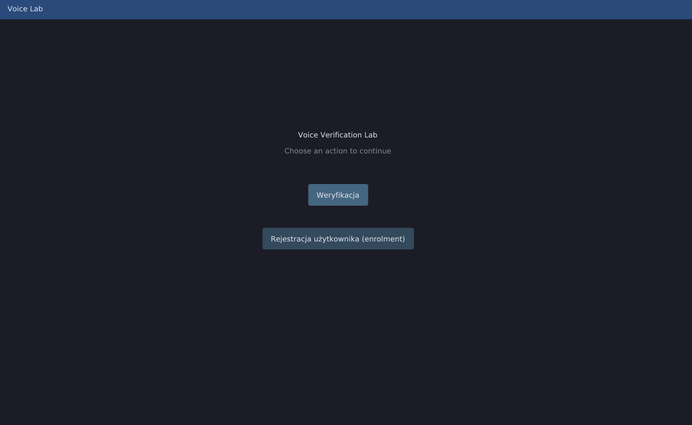
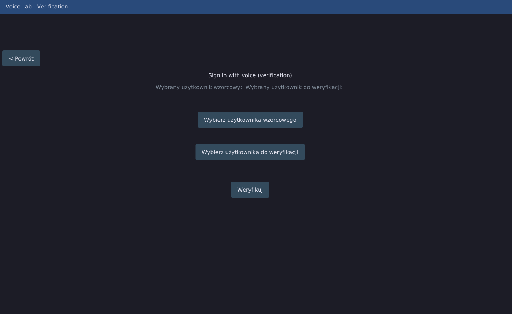
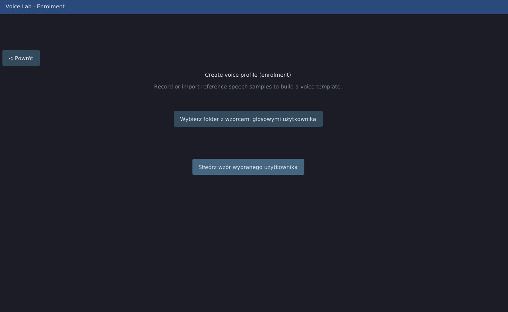

# VoiceLab
This project provides a GUI for the `sv-gmmubm`(https://github.com/Serhii-Nesteruk/sv-gmmubm) speaker verification system using **Dear ImGui**. 

--- 
Main View

---

Verification View

---

Enrolment View

---
